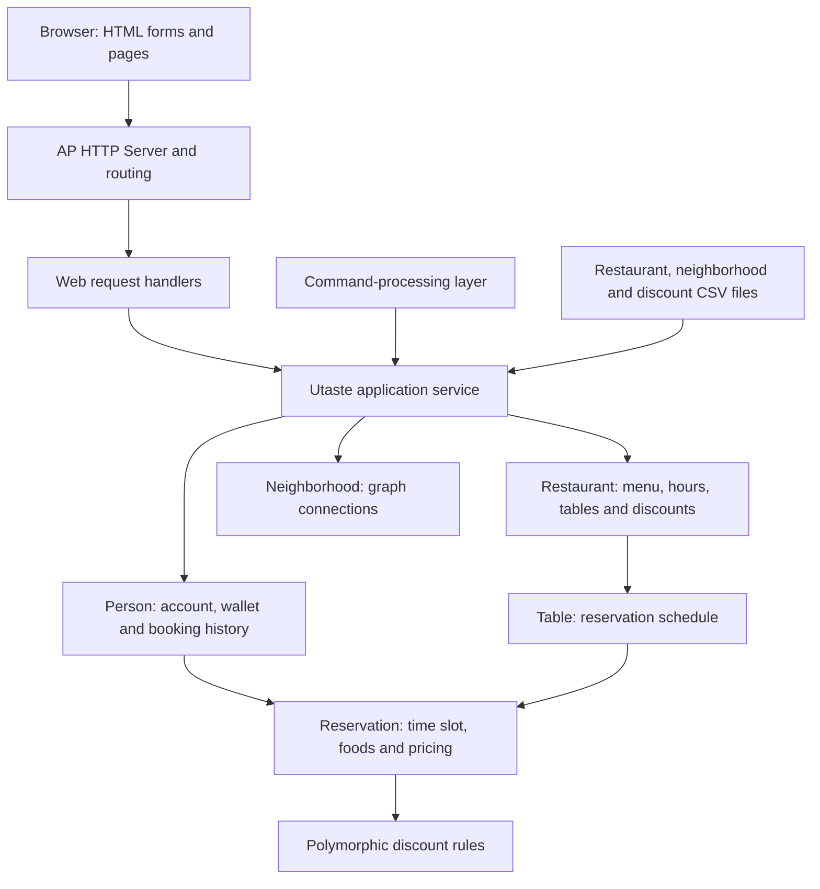

# UTaste

### Restaurant Reservation & Dining Management System

**UTaste** is a local C++ web application that brings together restaurant discovery, table reservations, food ordering, wallet accounting, and discount calculation. Its object-oriented domain model connects customers, restaurants, neighborhoods, menus, and table schedules through a shared application service.

The project combines **C++20 application logic**, **server-rendered HTML/CSS**, and the bundled **AP HTTP Server**. Alongside its browser interface, it includes a command-processing layer for operations such as neighborhood search, wallet management, and reservation cancellation.

## Features

### Restaurant Browsing

- Browse restaurants and open individual restaurant pages.
- View neighborhoods, opening hours, menus, and food prices.
- Inspect table schedules and discount information before booking.

### Accounts & Reservations

- Register an account, sign in, and sign out through the browser.
- Authorize protected actions using a browser session cookie.
- Reserve a specific table for a chosen start and end hour.
- Include food orders with a reservation; repeat food names to request multiple portions.
- Check restaurant hours, table IDs, menu items, wallet funds, and scheduling conflicts.
- Prevent overlapping reservations for both the table and the customer, while allowing adjacent bookings.
- View booking records with restaurant names, table numbers, food quantities, and original and final prices.

### Pricing & Wallet Logic

- Start each account with an internal wallet balance of **1,000 units**.
- Apply fixed-amount or percentage discounts to individual menu items.
- Apply first-order discounts based on the customer's restaurant order history.
- Apply order-total discounts when the configured spending threshold is met.
- Deduct the final food-order price from the wallet when a reservation succeeds.
- Preserve first-order eligibility when an attempted booking fails.

### Additional Domain Operations

The application service and command-processing layer also implement:

- **Neighborhood discovery:** represent connected neighborhoods as a graph and traverse them with breadth-first search (BFS) to prioritize restaurants by neighborhood proximity.
- **Food filtering:** select restaurants that serve a requested menu item.
- **Wallet management:** increase and inspect a customer's balance.
- **Reservation cancellation:** remove a booking from the customer's records and table schedule, and refund 60% of its final price.

These operations belong to the backend/command layer. The default executable starts the browser interface described above.

## Architecture



| Component | Responsibility |
| --- | --- |
| `Utaste` | Coordinate accounts, data loading, discovery, and reservation operations |
| `Person` | Manage credentials, login state, wallet, reservations, and order history |
| `Restaurant` | Own menu items, operating hours, tables, and discount configuration |
| `Table` | Maintain bookings and detect conflicting time intervals |
| `Reservation` | Store booking details, aggregate food quantities, and calculate prices |
| `Discount` and subclasses | Implement item, first-order, and order-total pricing rules through a common interface |
| `Neighborhood` | Model neighborhood names and adjacency relationships |
| `CmdHandler` | Parse text commands and dispatch domain operations |
| Web handlers | Read HTTP parameters, call application services, and produce HTML or redirects |

The repository includes HTTP routing, request parsing, response construction, cookies, URL encoding, static-file serving, and template utilities. Application pages use static HTML forms and HTML generated by C++ handlers.

## Reservation & Pricing Flow

1. A signed-in customer submits a restaurant, table ID, time interval, and food list.
2. The application validates the interval and checks the customer's existing reservations.
3. The restaurant checks its operating hours, table availability, and menu items.
4. The reservation calculates the food subtotal and applies discounts in sequence: **item discounts, first-order discount, then order-total discount**.
5. The wallet is charged, the booking is stored, and the customer's restaurant order history is updated.
6. The browser redirects to the reservation list.

Reservations occupy the interval `[start, end)`: a booking ending at 12 can be followed by one starting at 12. A conflict occurs when `new_start < existing_end` and `new_end > existing_start`.

## Technology & Engineering Concepts

| Area | Implementation |
| --- | --- |
| Language | C++20 |
| Web interface | HTML/CSS, forms, and server-rendered pages |
| HTTP infrastructure | Bundled AP HTTP Server using sockets |
| Domain design | Encapsulation, class composition, inheritance, and virtual dispatch |
| Object ownership | Shared pointers across related domain objects |
| Algorithms | BFS, interval-overlap detection, sorting, and quantity aggregation |
| Data structures | Vectors, maps, and queues |
| Input data | CSV files for restaurants, neighborhoods, and discounts |
| Build | GNU Make and `g++` |
| Checks | C++ regression checks and a Python HTTP smoke test |

## Getting Started

### Requirements

- A C++20-capable `g++` compiler
- GNU Make
- Linux or WSL with a POSIX shell
- Python 3 for the optional HTTP smoke test

### Build & Launch

From the project directory:

```bash
make -B
./Utaste Test/restaurant.csv Test/neighborhood.csv Test/Discounts.csv
```

Open **http://localhost:5000** in your browser.

`make -B` rebuilds the bundled object files from source. Supply all three CSV paths in the order shown, and start the executable from the project directory so it can find the HTML forms.

### Example Booking

Sign up, browse the restaurant list, and open **addReservation**. The included sample data supports this booking:

| Field | Value |
| --- | --- |
| Restaurant | `lanjin` |
| Table ID | `1` |
| Start hour | `10` |
| End hour | `11` |
| Foods | `pizza` |

Use restaurant and food names exactly as listed in the menus. Table IDs start at 1. Times are integer hours satisfying `1 <= start < end <= 24`, within the restaurant's operating hours. Separate food names with commas, for example `pizza,sib zamini`.

## Web Routes

| Method | Route | Purpose |
| --- | --- | --- |
| GET | `/` or `/Home` | Home page and navigation |
| GET / POST | `/signup` | Registration form and account creation |
| GET / POST | `/login` | Login form and authentication |
| GET | `/logout` | End the active session |
| GET | `/viewAllRestaurants` | Restaurant directory |
| GET | `/viewRestaurant?name=...` | Restaurant details |
| GET / POST | `/addReservation` | Reservation form and booking submission |
| GET | `/viewReservations` | Current customer's reservation records |

The reservation view also accepts `restaurant_name` and, optionally, `reserve_id` query parameters. Dedicated pages handle invalid requests, missing records, denied access, and empty reservation results.

## Project Structure

| Path | Contents |
| --- | --- |
| `src/` | Domain models, application service, and web/command handlers |
| `server/` | HTTP server and routing |
| `utils/` | Requests, responses, strings, encoding, and templates |
| `static/` | HTML forms and sample pages |
| `Test/restaurant.csv` | Menus, neighborhoods, hours, and table counts |
| `Test/neighborhood.csv` | Neighborhood adjacency data |
| `Test/Discounts.csv` | Restaurant discount rules |
| `Test/regression.cpp` | Domain regression checks |
| `Test/web_smoke.py` | HTTP workflow checks |
| `Makefile` | Application build and regression-test target |

## Tests

Run domain regression checks from the project directory:

```bash
make test
```

To exercise the web workflow, start a fresh server with the supplied CSV files, then run in another terminal:

```bash
python3 Test/web_smoke.py
```

The checks cover overlapping and adjacent reservations, cancellation IDs, failed orders and first-order eligibility, individual item discounts, price bounds, invalid form input, restaurant lookup, error pages, login/logout, and session access. The HTTP test creates an in-memory account named `smoke_user`.

## Local Operation

- The server listens on `127.0.0.1:5000`.
- Accounts, wallet balances, and reservations are held in memory for the running session and reset on restart.
- One account is active at a time; sign out before switching accounts.
- Bookings use table IDs and hourly intervals.
- CSV files use the formats shown in `Test/`, without header rows. Monetary values use integer units.
